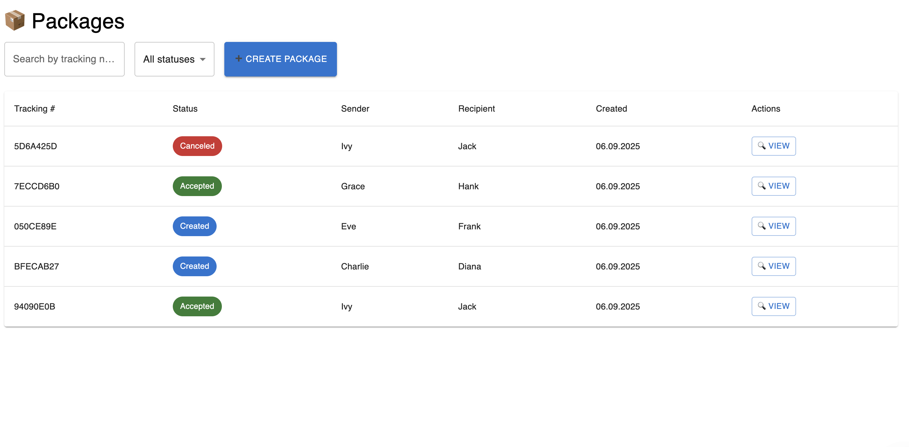
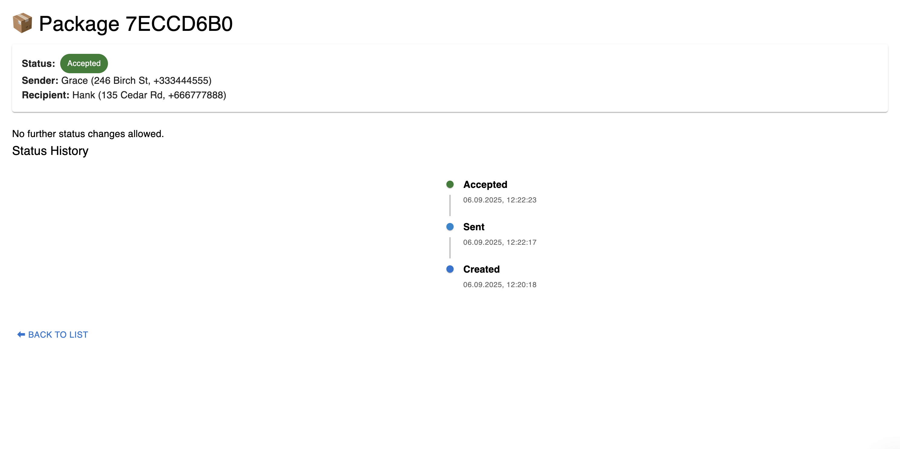
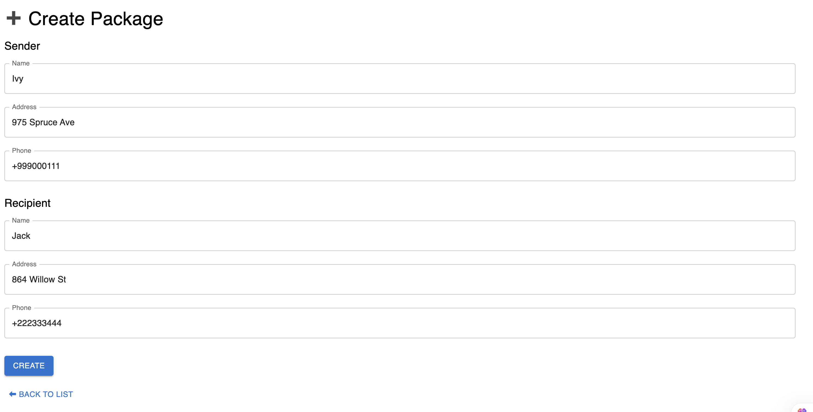

**README.md**

# 📦 Package Tracking UI

Frontend application for **Package Tracking System**.  
Built with **React + TypeScript + Vite** and connected to the backend API.

---

## 🌐 Live Demo

- **Frontend (Vercel):** https://package-tracking-ui.vercel.app ✅
- **Backend Swagger (Render):** https://package-tracking-api-vj76.onrender.com/swagger/index.html ✅

---

## 🚀 Features

- View all packages with their current status.
- Create new packages via a form.
- Update package status (with validation according to rules).
- Status history visualization (timeline).
- Toast notifications for success/error actions.
- Modal confirmation before status changes.
- Responsive UI with **Material UI** components.

---

## 🛠️ Tech Stack

- **React 18** + **TypeScript**
- **Vite**
- **Axios** (API requests)
- **React Router v6**
- **Material UI (MUI)**
- **React Hot Toast**

---

## ▶️ Getting Started

### 1. Clone the repo

```bash
git clone https://github.com/your-username/package-tracking-ui.git
cd package-tracking-ui
```

````

### 2. Install dependencies

```bash
npm install
```

### 3. Run locally

```bash
npm run dev
```

Local dev will start at:
👉 `http://localhost:5173/`

---

## 🔗 Environment Variables

Create `.env` file in the root:

```
VITE_API_URL=http://localhost:5259
```

For production (Vercel) it uses:

```
VITE_API_URL=https://package-tracking-api-vj76.onrender.com
```

---

## 📸 Screenshots

### Package List



### Package Details



### Create Package



---

## ✅ Evaluation Criteria

- Clean architecture with React Router.
- TypeScript types for data models.
- User-friendly UI with Material UI.
- Proper API integration (CRUD, status updates).
- Deployment on **Vercel** (UI) + **Render** (API).

```

---

👉 Рекомендую создать папку `docs/screenshots/` и сделать 2–3 скриншота (листинг, детали, создание) — это сильно улучшит впечатление при проверке.

Хочешь, я помогу тебе с git-командами, чтобы красиво закоммитить этот README и скриншоты в `frontend`-репозиторий?
```
````
